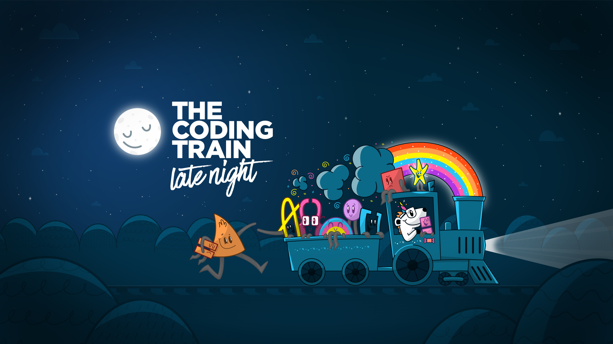

# [Episode 02](https://www.youtube.com/watch?v=0LZUSkwCYfU)

## Timestamps

- [3:51 - Intro](https://youtu.be/0LZUSkwCYfU?t=231)
- [26:48 - Enviroment Setting / Scraping](https://youtu.be/0LZUSkwCYfU?t=1608)
- [30:45 - Node Script for jokes API w/ Pagination](https://youtu.be/0LZUSkwCYfU?t=1845)
- [50:22 - RunwayML](https://youtu.be/0LZUSkwCYfU?t=3022)
- [01:01:16 - VSCode Settings](https://youtu.be/0LZUSkwCYfU?t=3676)
- [01:03:39 - HUE Lights - Start](https://youtu.be/0LZUSkwCYfU?t=3819)
- [01:15:10 - HUE Lights - Open Editor](https://youtu.be/0LZUSkwCYfU?t=4510)
- [01:15:10 - HUE Lights - Open Editor](https://youtu.be/0LZUSkwCYfU?t=4510)
- [01:20:00 - Checking ML Training for scraped DadJokes](https://youtu.be/0LZUSkwCYfU?t=4800)
- [01:25:25 - Gitch Apps](https://youtu.be/0LZUSkwCYfU?t=5125)
- [01:41:44 - Jokes in p5](https://youtu.be/0LZUSkwCYfU?t=6104)

## Metadata

| Field       | Value        |
| :---------- | -----------: |
| Date        | May 27, 2020 |

### Links mentioned
- [Enviroment Config/Shell](https://ohmyz.sh/)
- [Glitch Apps](https://glitch.com/)
- [RunwayML](https://runwayml.com/)
- [Coding Garden](https://coding.garden/)

